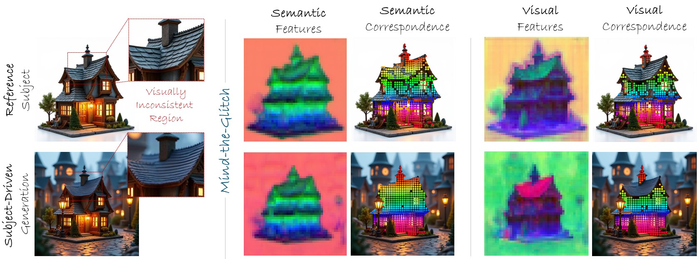

# Mind-the-Glitch

 

The official implementation for the Neurips 2025 paper "Mind-the-Glitch: Visual Correspondence for Detecting Inconsistencies in Subject-Driven Image Generation"

The code to be released soon.
